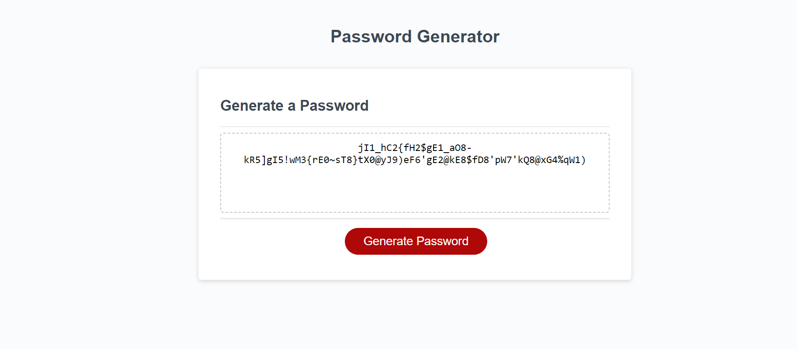

 Password Generator using Javascript (Bootcamp Challenge 5)

## Description 
This project is a JavaScript password generator allowing a user to create a randomly-generated password based on specified options. The user can choose the length of the password and which types of characters to include (lowercase letters, uppercase letters, numbers, special characters). The program generates a password by combining random characters from the chosen character arrays. The generated password is intended to be used as a login password to increase security.

### How to use this program

* Go to the website page, and respond to the prompts. 
* Now click the 'Generate Password' button, and your password will appear tailored to your stated preferences. 
* Link: 

Here is a screenshot of my project. 

### What I have learnt 

* I have learnt how to work with arrays and strings in JavaScript
* I utilised the `Math.floor` and `Math.random` functions to generate random numbers
* I have learnt how to use loops and conditional statemenents to control the flow of execution 
* I have learnt about defining and calling functions 
* I have learnt about returning values from a function using an object 
* I have learnt to use the DOM API to select and manipulate web-page elements. 

## Credits 

* https://www.w3schools.com/jsref/jsref_floor.asp
* https://www.w3schools.com/jsref/jsref_number.asp